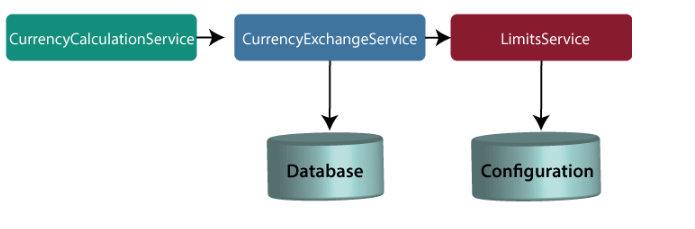
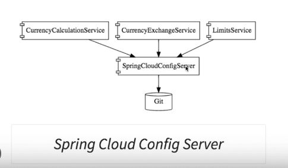
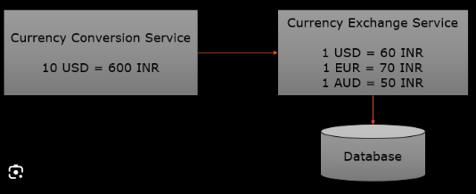
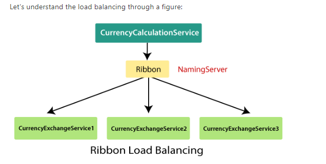
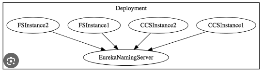

https://www.javatpoint.com/microservices

---------------------------------------
Ports Standarization

- spring cloud config server = 8888
- limits-service = 8080
- currency exchange service = 8000, 8001, 8002,....
- currency conversion service = 8100, 8101, 8102,....
- Eureka naming-server = 8761

----------------------------------------
Microservice Base layout of project

-----------------------------------------
Step 0 - Initialize the local-git-repo for Spring-Cloud-Config-Server

-----------------------------------------
Step - 1 - Base Layout of two microservices

- currency conversion service
- currency exchange service -> CURD ops

-----------------------------------------
Step - 2 - Load Balancing

------------------------------------------
Step - 3 - Naming Server to get upInstance details

